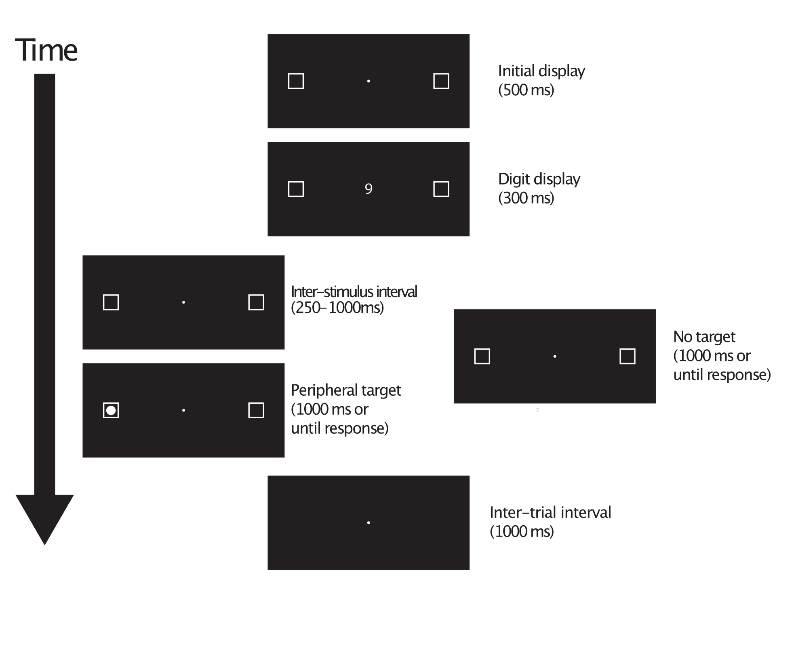
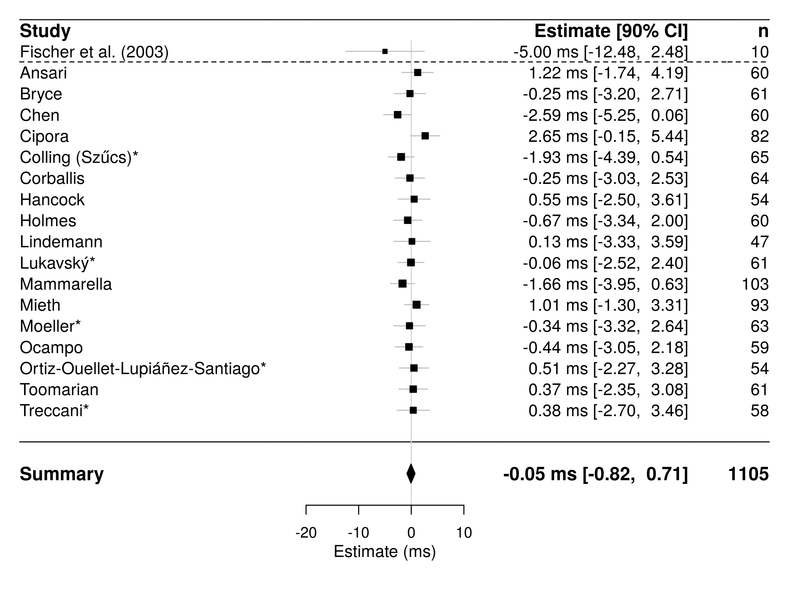
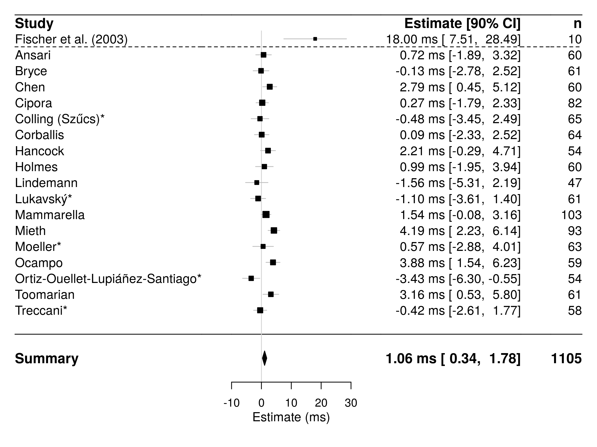
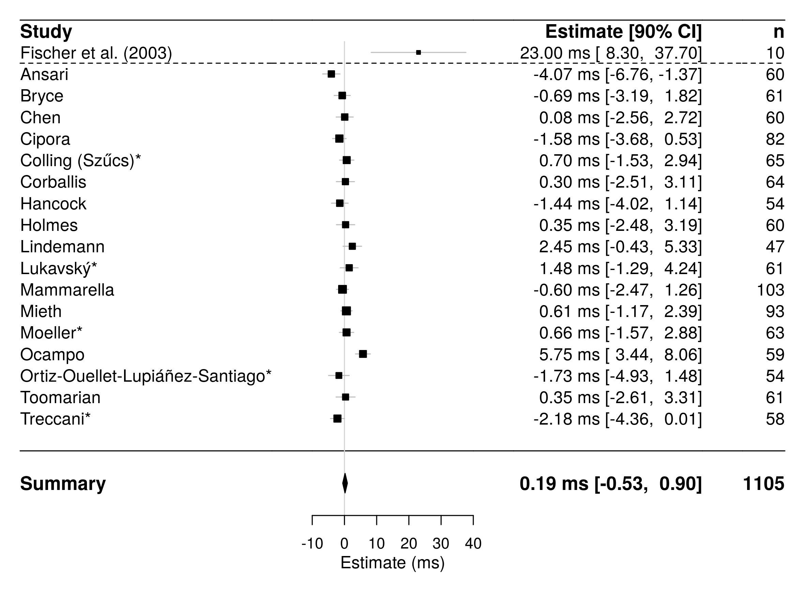
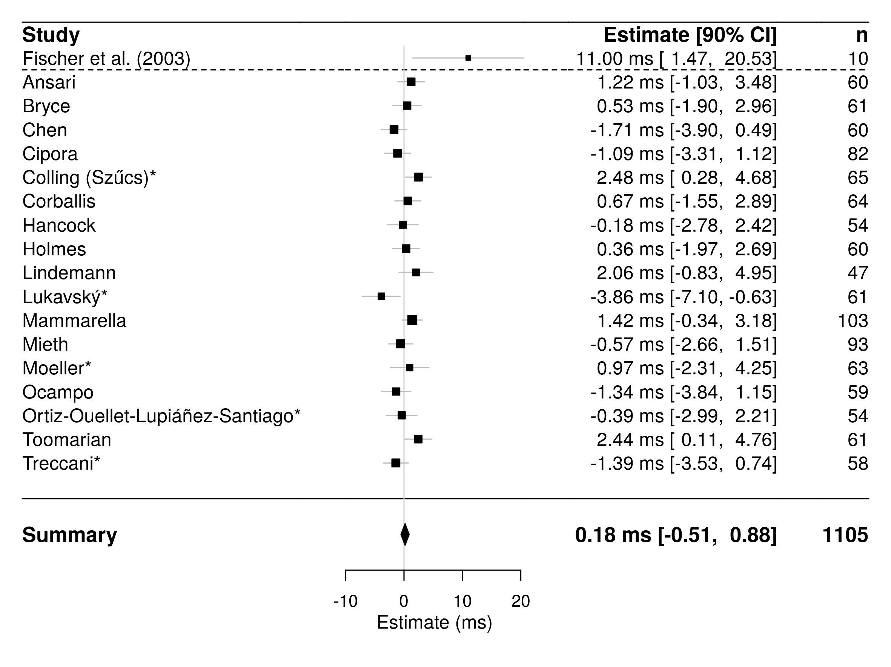

```{r include=FALSE}
require(tidyverse)
require(plotly)
library(widgetframe)
ReplicationProjectTools::GetLabNames()

tibble(LabNames,Nodes) %>% arrange(desc(LabNames)) -> LabLabels
rbind(tibble(LabNames = "Summary", Nodes = "meta"),LabLabels) %>% add_case(.after =  1) %>% mutate(LabNames = ifelse(is.na(LabNames),"",LabNames),  Nodes = ifelse(is.na(Nodes),"",Nodes)) -> LabLabels
```
# Introduction

- A multi-lab project (17 Labs)

- Materials translated into Dutch, Italian, German, Spanish, Chinese, and Czech

- Data collected from 1000+ participants

- "Triple badged"   
   <span class="grey">Open Data</span>  
   <span class="grey">Open Materials</span>  
   <span class="grey">Preregistered</span>  

----

## Project background

- *S*patial *N*umerical *A*ssociation of *R*esponse *C*odes (SNARC) effects (e.g., Dehaene et al. 1993; Fias et al. 1996) are well established in the literature.

- When people perform number categorisation tasks (parity judgements, magnitude judgements etc) they're quicker at responding to small numbers with the left hand and to large numbers with the right hand

- Lots of debate about the origin of the SNARC effect (see Gevers et al. 2003; Bächtold et al. 1998; Keus and Schwarz 2005; Proctor and Cho 2006)

----

## Proposed mechanisms for the SNARC effect

- Some accounts link the SNARC effect to mental number line (Dehaene et al. 1993) and argue that it suggests a tight link between Number and Space (Fischer and Brugger 2011)

- Other accounts implicate working memory (van Dijck and Fias 2011), or suggest the later/response-dependent mechanisms generate the SNARC effect (Keus and Schwarz 2005)   

<center>Is there an experiment that can settle this debate?</center>


----

## The attentional SNARC effect

Maybe there is...
<center>
```{r echo=FALSE, out.width="65%",fig.pos="C"}
knitr::include_graphics("FischerHeader.png")
```
</center>

- Fischer et al (2003) used an attentional cueing task to demonstrate that merely observing (task irrelevant) numbers caused shifts in spatial attention to the left or the right depending on the *magnitude* of the number

- This finding has been used to support strong claims about the link between number and space

----

### Fischer et al's task

```{r echo=FALSE, fig.cap="Trial timing and structure", out.width="65%"}

```


----

### The headline finding

```{r echo=FALSE, fig.cap="Results from Fischer et al (2003; Experiment 2; N=10)", out.height="80%", message=FALSE, fig.height=5, fig.width=10}
readr::read_csv("Original_estimates.csv") %>% ggplot(aes(x = delay, y = RT, ymax = (RT + (qnorm(.95) * se)), ymin =  (RT - (qnorm(.95) * se)))) + geom_errorbar(width = 10) + geom_point(size = 3) + scale_x_continuous(name = "Cue-target interval (ms)", breaks = c(250,500,750,1000)) + scale_y_continuous(name = "Magnitude-target location congruency effect (ms)") + geom_hline(yintercept = 0, linetype = 2)+ theme_minimal()
```

----

### The attentional SNARC effect

This finding has been incredibly influential

- cited 600+ times and continues to be cited regularly

- and it's been used to support <b>strong claims</b> about the link between number and space

<!-- <center>But is it true?</center> -->


# Putting together a multi-lab RRR

Putting together a multi-lab RRR is a lot of work, so you need to decide whether the finding is import

**What makes a finding important?**

1. Highly influential—lots of citations; used as the basis for other experiments; important in settling theoretical debates

2. Doubts over replicability—has it been replicated many times in high quality experiments

3. Quality of initial experiment—publication bias *possibly* has a greater influence on literatures when the initial experiments are low quality   

---

## The att-SNARC effect seems to fit

- Within the spatial-numerical association literature the Fischer et al (2003) finding is of great theoretical importance

- But if you go to *number cognition* conference you'll meet a lot of people who don't believe it

- And the original finding was reported in a small sample (Experiment 1: N = 15, Experiment 2: N = 10)

<center>Have there been any replication attempts?</center>

---

## Previous replication attempts

<!--
<small>Several reported in the literature including; however, it's all a bit messy with some reporting left-side and right-side targets separately, some collapsing over both sides, some reporting estimates for specific ISI conditions, and some collapsing across ISI, some reporting estimates without variances, and some omitting estimates completely!-->

- Galfano et al (2006) collapsed across 500 and 800 ms [Right-side target = 6.5 ms, *t*(25) = 1.75, *p* = .046 (reported as p = .04); Left-side targets = 5.5 ms; *t*(25) = 1.59; *p* = .062 (reported as *p* = .04)].

- Dodd et al (2008) collapsed across 250, 500 and 750 ms [both sides = 5.5 ms; *F*(1,29) = 4.05; *p* = .054 (reported as *p* < .05)]. At 500 ms ISI [Right-side targets = 6 ms, *t*(29) = 2.34, *p* = .013; left-side targets = 16 ms, *t*(29) = 2.48, *p* = .010].

- Ristic et al (2006) collapsed across six ISI conditions between 350 and 800 ms [both sides = 3.79 ms; *F*(1,17) = 5.48; *p* = .032].<sup>*</sup>

<!--</small>-->


<smaller><sup>\*</sup>This implies a SD of ~6.8 ms, which is *surprisingly* low, considering most studies report SDs of 15–30 ms</smaller>

----

## Failed replication attempts
<small>
<ul><li>Zanolie and Pecher (2014) collapsed across four ISIs between 250 and 750 ms and across left and right side targets [Experiment 1: No estimates reported; *F*(1,19) = 0.03, *p* = .863; Experiment 2: No estimates reported; *F*(1,23) = 0.13, *p* = .772].</li></ul>

- Ranzini et al (2009) collapsed across three ISIs between 300 and 500 ms and across left and right side targets [Estimate = 3 ms; *F*(1,14) = 4.1, *p* = .06].

- Salillas et al (2008) at a 400 ms ISI across left and right side targets [Estimate = 2 ms; *F*(1,11) = 1.3, *p* = .28].

- van Dijck et al (2014) collapsed across four ISIs between 250 and 1000 ms and left and right side targets [Experiment 1: No estimates reported] and three ISIs between 100 and 700 ms [Experiment 2: No estimates reported; *F*(1,28) = 2.94, *p* = .097].

- Fattorini et al (2015) collapsed across  500 and 750 ms and across left and right side targets [Experiment 1: No estimates reported; *F*(1,59) = 1.69, *p* = .20] and four ISIs between 250 and 1000 ms [Experiment 2: No estimates reported; *F*(1,31) = 1.5, *p* = .22].

</small>

----


The previous literature is extremely messy

- In general, the quality of the statistically reporting is extremely poor

- Estimates (if available) are reported without variances!

- Left and right side targets are sometimes separate sometimes not

- *p* values misreported! and more!

Reported effects more consistent with a **true null** than a **true effect** yet Fischer et al. (2003) is still very well cited

<center>So it really needed an RRR</center>


# Approaching a journal

Armed with this knowledge we approached AMPSS (at the time this Perspectives in Psychological Science) to see if they're be interested in publishing an RRR...

<b>Why AMPSS?</b>

They have loads of experience in multi-lab registered replications (and Alex Holcome is the editor… the editor will become your best (only?!) friend…)

<center>Before AMPPS agree to publish it they ask for a pre-submission</center>

----

## Putting together a pre-submission

<div class="shadow">

We receive many pre-proposals, and can move forward only with those with the highest replication value that are feasible for this multi-lab approach. Suitability of a study for an RRR reflect whether:

a. The study has been influential in the field
b. The study is methodologically sound and the interpretation of the result unambiguous
c. The study forces a reconsideration of an important theory or establishes the foundation for a theoretical position
d. The study has not yet been the subject of published replications, or those replication have yield inconsistent results
e. There is a reason for substantial uncertainty about the size of the effects
f. Theories of or empirical understanding of the effect would benefit from a more precise estimate of the effect's size
g. Other labs likely would want to join the replication effects

Below, in fewer than 750 words, please address these criteria

</div>

----

## Once the pre-submission was accepted

```{block, type="smallish"}

**We put together a full protocol**

- Detailed the methods for running the main experiment
  - Everything from how to install the code, how to calibrate the monitor, how to position the subject has to be detailed, how to name the data files (more on this later?!)
- Include tasks to assess possible moderators of the effect that haven’t been directly examined before
  - Finger counting habits, reading habits, mathematical skills, math anxiety
- Write analysis scripts for the multi-lab meta-analysis and detail main analyses with simulated data
- Compile all the experimental materials, including scripts for running the experiment
- This was all sent out to the original authors for checking and comments

```


----

### Moderators

```{block, type="smallish"}
- Several moderators of spatial-numerical associations have been suggested (e.g., Fischer 2006, 2008; Fischer and Knops 2014; Georges et al 2016; Shaki et al 2009)

Instead of **just** doing a replication, we wanted to also advance the field, so we measured as many (putative) moderators as possible.

- Finger counting (based on the syllable counting task of Lucidi and Thevenot 2014)

- Reading/writing direction (grouping participants into exclusive left-to-right readers/writers and other)

- Handedness (based on Nicholls et al. 2013, with culture-specific changes made where appropriate)

- Mathematics fluency (based on Tibber et al. 2013; which itself is adapted from Woodcock and Johnson 1989)

- Mathematics anxiety (AMAS; Hopko et al. 2003)
```
----

## After the protocol was accepted

**We put out a call for labs to join**

- Labs now apply to join by filling in a form on the APS website

- Give details about their setup, and any planned deviations from the registered protocol (this has resulted in another suggestion for a possible moderator that will be included in the main protocol)

- The applications are checked by the action editor (and me, as the RRR lead author)

- The action editor sends out acceptances

- Data collection begins

<center>And then the wheels come off...</center>

[Link to OSF pages](author_affiliations.html)


# What can go wrong will go wrong

My lovely detailed analysis plan, pre-tested with simulated data, maybe wasn't the best idea...

- Our initial plan was to use **standard** random effects meta-analysis. It's the standard because everyone does it... But should they?

- RMA would treat the outcomes as independent, and wouldn't be able to adequately account for the complex nested structure of the data (moderator groups nested within moderator groups nested within labs etc)

So, midway through data collection we scrapped the analysis plan!

## A new plan

- We scrapped our plan and proposed a new one...

- Our new plan was single multi-variate, multi-level model (instead of a bunch of independent RMA analyses)

The new plan was written up and sent back to the editor for approval...

<center>But this was not the end of it...</center>

Once that data **actually arrived** we realised that we'd have lots of gaps because we wouldn't have any participants in certain sub-groups, so we suggested a **new plan**!

The new plan was written up and sent back to the editor for approval...

----

### Final analysis plan

- DVs of interest were the congruency effects at each of the four ISI conditions (i.e., 250, 500, 750, and 1000 ms)

- Used multilevel multivariate meta-analytic models (McShane and Böckenholt 2018) to account for the dependence between multiple DVs and the more complex nesting structure (participants within moderator groups and moderator groups within labs). One model for each categorial moderator. 

- Considered several specifications* of each model, with the reported version selected by AIC (Akaike 1974)

- Also fit a multilevel model to the participant level data for the continuous modertors. 

<smaller>* The different specifications do things like: Fix the variances between between the DVs, fix the correlation between the DVs, etc.  

----

#### MODELS

Model 1: No Moderators

Model 2: Finger counting (two groups)

Model 3: Reading/writing direction (two groups)

Model 4: Handedness (two groups)

Model 5: Mathematics fluency and mathematics anxiety (multilevel model fit to the participant-level congruency effects)


---

## Equipment failure

- Not every scientist has the same technical skill level or access to the same level of technical support

- Our protocol recommend (but didn't **require**) the use of an eye-tracker, and I provided appropriate code for an Eyelink-1000 (because that's what I had access to)

- But what about people that have a different eye-tracker?

- Or people that don't have much experience using their eye-tracker?

This left me spending many many hours moonlighting as tech support...

## User error?!

Nobody will follow your instructions!

- The protocol gave detailed instructions on how to, for example, name data files so they could be processed easily, but very few people followed them

- This resulted in me coding workaround after workaround to get everything processed smoothly

- But, ultimately, this was my own fault

  - **Never** rely on people to **do things**—build in backups, contingencies, error checks, redundancies. **Never** assume...


# Results

```{r echo=FALSE, fig.cap="250 ms ISI Condition (Model 1—No moderators)", out.width="65%"}

```
----
```{r echo=FALSE, fig.cap="500 ms ISI Condition (Model 1—No moderators)", out.width="65%"}

```
----
```{r echo=FALSE, fig.cap="750 ms ISI Condition (Model 1—No moderators)", out.width="65%"}

```
----
```{r echo=FALSE, fig.cap="1000 ms ISI Condition (Model 1—No moderators)", out.width="75%"}

```
----

```{r echo=FALSE, fig.cap="Summary of meta-analytic models (250 ms ISI)", out.width="95%",fig.height=3,fig.width=10}
readRDS(file = "p1.rds")
```

----

```{r echo=FALSE, fig.cap="Summary of meta-analytic models (500 ms ISI)", out.width="95%",fig.height=3,fig.width=10}
readRDS(file = "p2.rds")
```

----

```{r echo=FALSE, fig.cap="Summary of meta-analytic models (750 ms ISI)", out.width="95%",fig.height=3,fig.width=10}
readRDS(file = "p3.rds")
```

----

```{r echo=FALSE, fig.cap="Summary of meta-analytic models (1000 ms ISI)", out.width="95%",fig.height=3,fig.width=10}
readRDS(file = "p4.rds")
```

----

## What counts as a *successful* replication?

- The standard definition of replication: if both failed stat sig or both attained stat sig (directionally consistent)

- But we need a better understanding of how stat hypotheses relate to scientific hypotheses (Amrhein et al. 2019; Colling and Szűcs 2018).

- Whether a theory is supported by data depends on whether the magnitude of the observed effect is consistent with the theory (Gelman and Carlin 2014).

- In discussing our results, we do so in light of the scientific hypothesis advanced by Fischer et al. (2003).

----

## Results

<small>

- The effects we observed both within and across labs were miniscule—around 1 ms—and incompatible with those of around 20 ms observed in Fischer et al. (2003)

- A difference of 1 ms is too small for any neurally or psychologically plausible mechanism, and Therefore, we conclude that we have failed to replicate the effect reported by Fischer et al. (2003).

- Because of the variability between participants 50% show positive congruency effect and 50% show negative congruency effect

- The effects we observed were also highly consistent not only across ISI conditions but also—perhaps more surprisingly—across labs

- Suggests there are unlikely to be lab-level moderators driving our results

</small>

# Things I've learned along the way

The whole project didn't run as smoothly as I had hoped

But through the process I learned a lot about 

- Good ways to share data

- How to managed projects that involve lots of different labs

- How to write preregistrations

- How to work in a reproducible way

--- 

## Sharing data

- I programmed the experiment in PsychToolBox (running on Matlab or Octave) and saved data as .mat files

- This was a terrible idea! You can read them into R but it's clunky and slow, which you don't notice till you try read 3000+ files...and it's not open format

- Sharing **data** on the OSF is also *suboptimal* (it's good for early stages though)

**Keep in mind**: **F**indability, **A**ccessibility, **I**nteroperability, **R**eusability

If I did it again, I'd use an open format (my current fav format is JSON)

---

## Running mutl-lab projects

- Everybody has their own way of doing things and some things you think are **obvious** (e.g., don't put spaces in file names) are not obvious

- Giving good instructions isn't always enough. You need to build your tasks and systems so that there isn't room for things to go wrong

---

## Preregistration 

- Preregistration is hard

- There'll always be things you, or the reviwers, didn't think of

- Or a new technique mind even become commonly available (e.g., multilevel multivariate meta-analysis)

- A good editor will let you make changes in the changes are **reasonable**, **sensible**, and not **compromise** the principle of preregistration


Preregistration isn't a **religious cult** despite how it sometimes comes across (on twitter)

---

## Reproducibility 

- Working in a completely reproducible way will make your life so much easier

- Have a pipeline that goes from 

   - **Data** → **Analysis** → **Manuscript**
   
   - and that can be edited, re-run, and ensures the same results each time
   
[Link to GitHub](https://github.com/ljcolling/fischerRRR-manuscript/tree/dev)
  
   

   


# ACKNOWLEDGEMENTS

```{block type="acks"}
**Contributors**

Damiano De Marco, Krzysztof Cipora, Rolf Ulrich, Hans-Christoph Nuerk, Mojtaba Soltanlou, Donna Bryce, Sau-Chin Chen, Philipp Alexander Schroeder, Dion T Henare, Christine K Chrystall, Paul M Corballis, Daniel Ansari, Celia Goffin, H Moriah Sokolowski, Peter JB Hancock, Ailsa E Millen, Stephen RH Langton, Kevin J Holmes, Mark S Saviano, Tia A Tummino, Oliver Lindemann, Rolf A Zwaan, Jiří Lukavský, Adéla Becková, Marek A Vranka, Simone Cutini, Irene Cristina Mammarella, Claudio Mulatti, Raoul Bell, Axel Buchner, Laura Mieth, Jan Philipp Röer, Elise Klein, Stefan Huber, Korbinian Moeller, Brenda Ocampo, Juan Lupiáñez, Javier Ortiz-Tudela, Juanma De la fuente, Julio Santiago, Marc Ouellet, Edward M Hubbard, Elizabeth Y Toomarian, Remo Job, Barbara Treccani

**Handling Editor at AMPPS**

Alex Holcombe

**Original Authors**

Martin Fischer and Jay Pratt for their help in with the protocol and some advice on measures

**Funder**

LJC and DS are funded by James S. McDonnell Foundation 21st Century Science Initiative in Understanding Human Cognition (grant number 220020370; received by DS)

```


